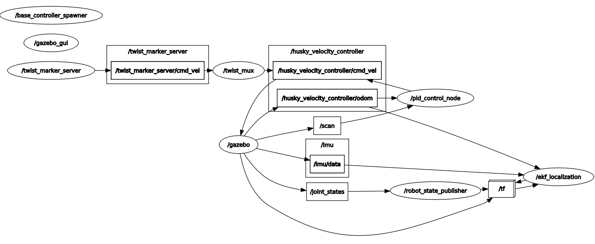
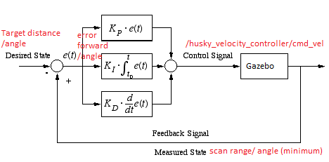

# **PID Control on Gazebo ROS with Husky robot**
Continuous Assessment 1 of ME3243 Robotic System Design (NUS)


*Fig 0: Husky robot stop at target distance = 1.1m away from pillar*


## Objective
This project makes use of PID controller to control the motion of a Husky robot in a virtual environment to understand how to tune a PID. The husky robot can be controlled through two input commands - forward/backward motion and steering motion. The simulation world consists of 1 pillar which is our target destination.



*Fig 1: RQT Graph of all active ROS Nodes*


### Description of PID control


*Fig 2: Pseudo code for PID control*

* **P** (proportional) accounts for present values of the error. For example, if the error is large and positive, 
the control output will also be large and positive.

* **I** (integral) accounts for all past values of the error. For example, if the current output is not sufficiently 
strong, the integral of the error will accumulate over time, and the controller will respond by 
applying a stronger action.

* **D** (differential) accounts for possible future trends of the error, based on its current rate of change.


### Simulation Parameters

Parameters are stored in config.yaml and the value can be experimented conveniently.

* PID parameters used for **forward/backward motion**  

    * Kp_f 
    * Ki_f 
    * Kd_f

* PID parameters used for **steering motion**

    * Kp_a 
    * Ki_a 
    * Kd_a

* Target parameters used for **position control**

    * target_distance (distance away from illar)
    * target_angle (heading w.r.t. pillar)


### Result


As shown from the error convergence graph, both errors have converged successfully to zero over time. Some fluctuations can be observed at the beginning of motion. This is believed to be an *ROS laser scan initialization issue*. To be more specific, the laser information is published in regular time during initialization period. 


## Dependencies
#### Tested on ROS Melodic

- husky simulator
- ROS Gazebo


## Basic Build Instructions

1. Clone this repo
2. Edit gazebo_pid/config/config.yml

Look for and change the value for to the *target distance* and *target angle* that you intend to reach.

```
target_distance : 1.1
target_angle : 0.0
```

3. Launch the package 
```
cd catkin_ws
catkin_make
roslaunch gazebo_pid gazebo_pid.launch
```

